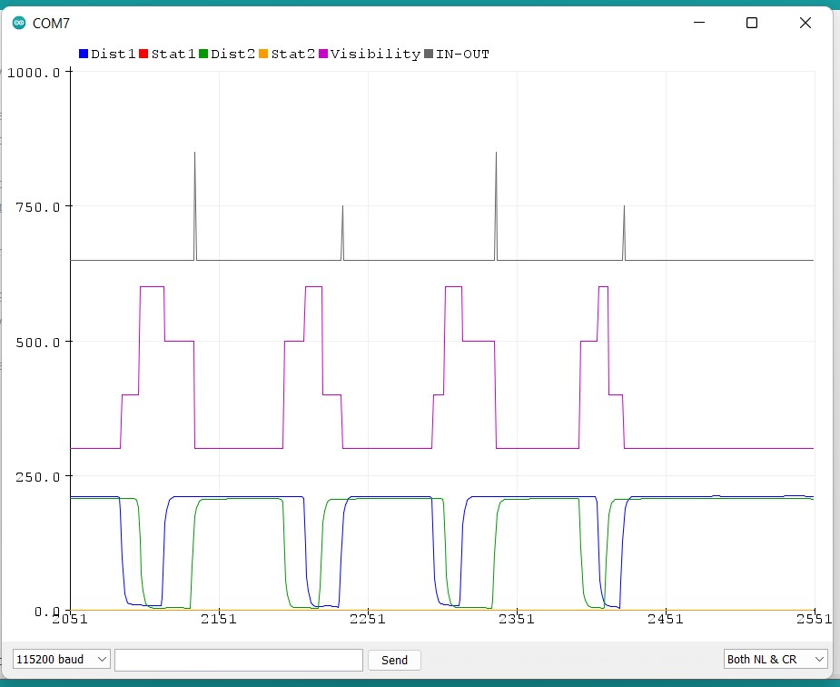

# DualLIDARI2C
A class for working with two TFMINI-S/Plus sensors to determine direction of 
travel for a target along with presence detection. 

Makes Use of Bud Ryerson's TFMini Plus LIDAR library for I2C. 

To use this library, you'll need two TFMinis configured for I2C operation, set to two
different I2C addresses. (Bud's library contains example code for doing this.) The default 
addresses are asumed to be decimal 10 and 11 but you can use what you like, if you specify 
them at initialization. 

The gist of the direction of travel determination is to track changes in 'visibility' on each 
sensor. A target is considered 'visible' if is detected on a sensor at a distance within a 
user configurable 'read zone' (range_min, range_max). 

If the LIDARS are positioned a bit apart so that their read zones overlap a bit, you can watch 
visibility change as a target passes. For example: 

    VisibleOnNeither -> VisibleOn1 -> VisibleOnBoth -> VisibleOn2 -> VisibleOnNeither

Might be a target passing from "left to right". A different pattern would obtain for moving 
"right to left". 

In the figure below, we show the output of the test_dual_lidar.ino example app using the Serial Plotter Utility from the Arduino IDE: 

1. Top Trace: In/Out Event Detection
2. Pink Trace: Visibility
3. Bottom Traces: LIDAR 1/2 Distances

The class also provides some functions for 'de-Glitching' and 'smoothing' the signals to improve performance. 

Author: 
J. Price, Digame Systems, 2022.

See: https://github.com/digamesystems/DualLIDARI2C